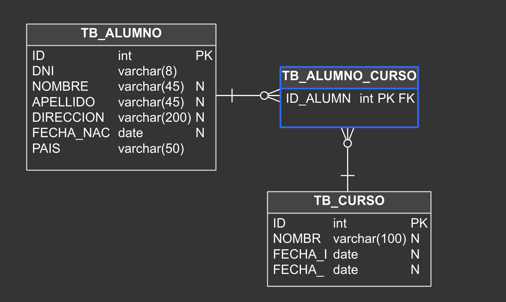

# **ACADEMIC ENROLMENT SYSTEM** [](http://pepy.tech/count/shallow-backup)

The present project is a REST API developed in ``Flask 2.3.2.``

The API provides the following resources:

- **Enrollments**: Allows for querying, creating, updating, and deleting enrollments.
- **Students**: Allows for querying, creating, updating, and deleting students.
- **Courses**: Allows for querying, creating, updating, and deleting courses


Contents
========

* [Installation](#installation)
* [Environment Variables](#environment-variables)
* [Entity relationship model](#entity_relationship_model)

### Installation
---

> **Warning**
> You can carry out the implementation of this project locally in two ways: by cloning the repository or by using the public Docker image. Detailed explanations for both approaches will be provided below.

#### Method 1: Cloning the repository

```bash
$ git clone https://github.com/GabrielGonzalesRamos/FlaskMatricula.git
$ cd FlaskMatricula/
$ pip install -r requirements.txt
$ python app.py
```

#### Method 2: Using the public Docker image

> **Warning**
> If you prefer to use the public Docker image, it is recommended to run the docker-compose file to deploy the necessary PostgreSQL service to ensure its proper functioning.

```bash
$ docker-compose -f docker-compose.yml up -d
```
```bash
$ docker pull docker.io/gabrielgonzales/gg-dev:GDR-001
```

### Environment Variables
---

Regardless of the implementation you choose, it will be necessary to configure the required environment variables as follows:

- **``ENVIRONMENT``** : This variable should be set to either **``PROD``** or **``DEV``** according to the environment in which you intend to run the application.

- **``DATABASE_URI_PROD``**: This variable represents the database URI when the **``ENVIRONMENT``** variable is set to **``PROD``** The current project uses PostgreSQL drivers. If you wish to use another database engine, you will need to make the necessary modifications to the connection URI.

- **``DATABASE_URI_DEV``**: This variable represents the database URI when the ENVIRONMENT variable has a value other than **``PROD``**

### Entity relationship model
---


The following ER diagram depicts the structure of a database designed to store information related to students and courses.

#### Entities:

- **``TB_ALUMNO``**: Represents an individual enrolled in a course.

- **``TTB_CURSO``**: Represents an academic program offered by an educational institution.

#### Attributes of the Student:

- **``ID``**:  Unique identifier of the student.
- **``DNI``**: Student's national identification number.
- **``NOMBRE``**: Student's first name.
- **``APELLIDO``**: Student's last name.
- **``DIRECCION``**: Student's address.
- **``FECHA_NACIMIENTO``**: Student's date of birth.
- **``PAIS``**: Student's country of origin.

#### Attributes of the Course:

- **``ID``**: Unique identifier of the course.
- **``FECHA_INICIO``**: Start date of the course.
- **``NOMBRE``**: Course name.
- **``FECHA_FIN``**: End date of the course.

#### Relationships:

The relationship between the **``TB_ALUMNO``** and **``TB_CURSO``** entities is represented by the **``TB_MATRICULA``** entity. The Enrollment entity includes two attributes:

- **``ID_ALUMNO``**: Identifier of the student enrolled in the course.
- **``ID_CURSO``**: Identifier of the course in which the student is enrolled.